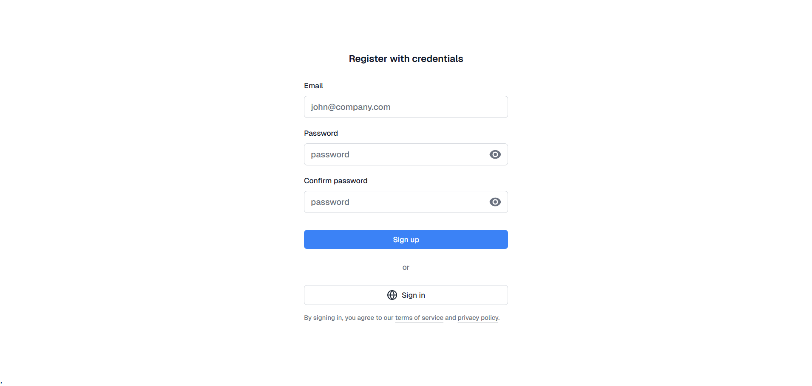
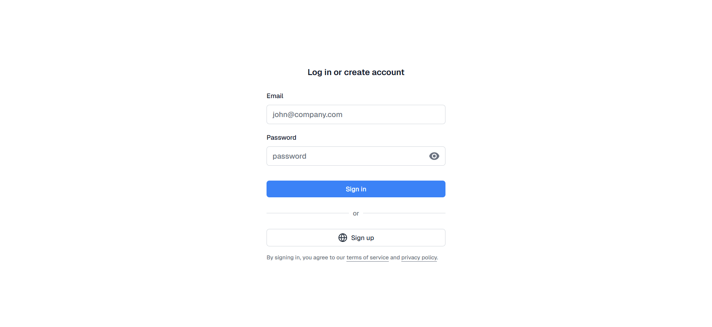
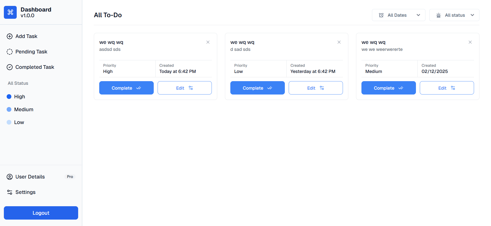
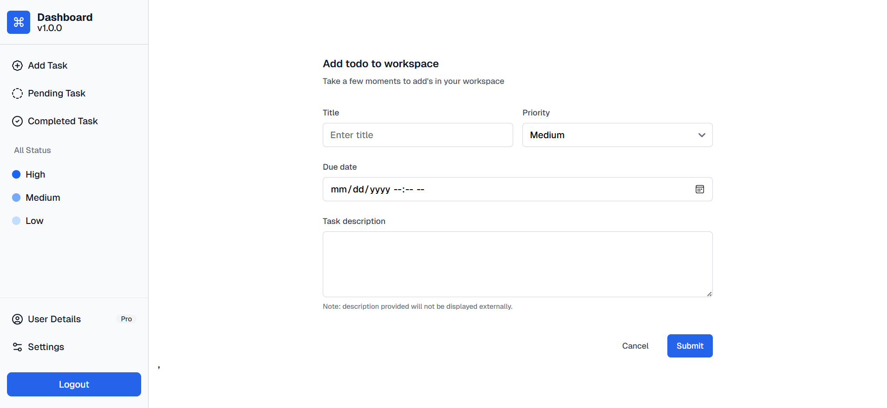
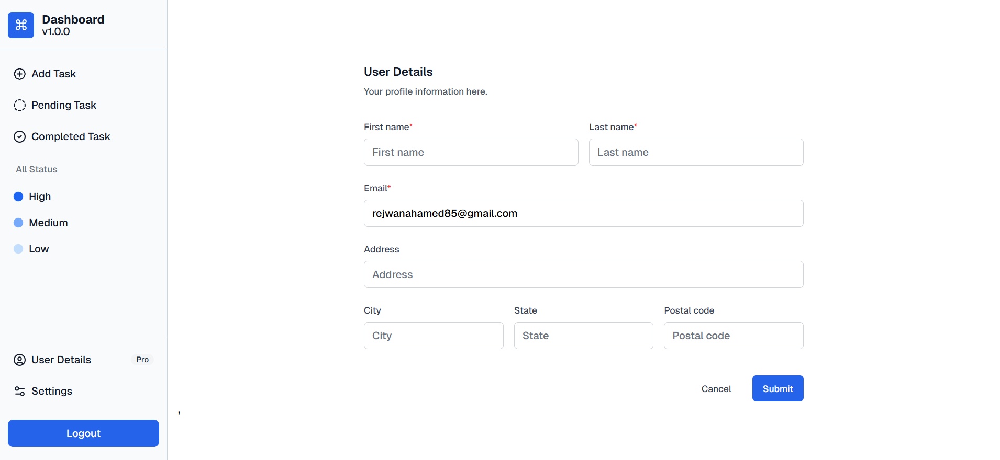
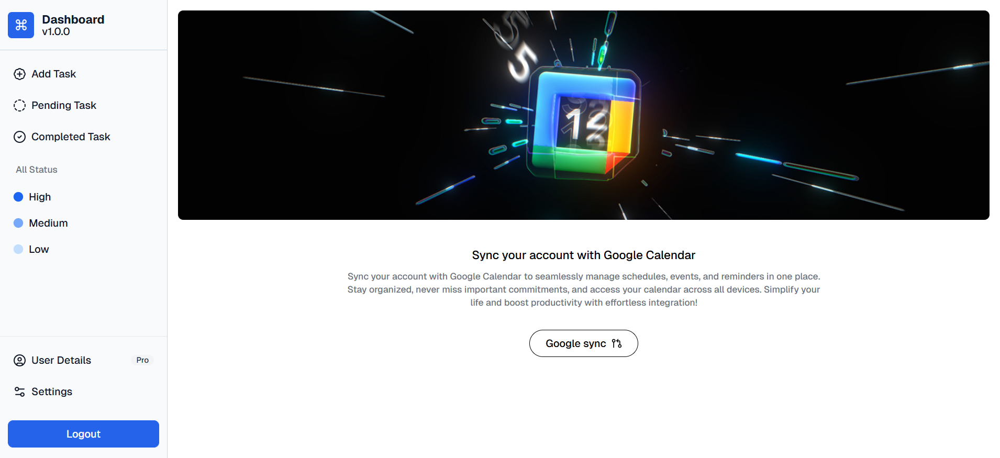

# To-Do App Frontend

## Description

The To-Do App Frontend is a user-friendly interface for managing your daily tasks. It allows users to register, log in, and manage their to-do lists efficiently. The app provides features such as adding new tasks, editing existing tasks, deleting tasks, and marking tasks as completed. Additionally, users can sync their tasks with Google Calendar for better task management.














## Prerequisites

- Node.js (>=14.x)
- npm (>=6.x)

## Project Setup

1. **Clone the repository:**

   ```bash
   git clone https://github.com/yourusername/to-do-app-frontend.git
   cd to-do-app-frontend
   ```

2. **Install dependencies:**

   ```bash
   npm install
   ```

3. **Run the development server:**
   ```bash
   npm start
   ```

## Usage

- Open your browser and navigate to `http://localhost:5173/` to see the app.
- Use the app to add, edit, and delete to-do items.

## Features

- **Add To-Do:** Add new tasks to your to-do list.
- **Edit To-Do:** Edit existing tasks.
- **Delete To-Do:** Remove tasks from your list.
- **Mark as Complete:** Mark tasks as completed.

## Folder Structure

```
to-do-app-frontend/
├── public/
│   ├── index.html
│   └── favicon.ico
├── src/
│   ├── assets/
│   │   └── images/
│   ├── components/
│   │   ├── Header.js
│   │   ├── Footer.js
│   │   └── ...
│   ├── pages/
│   │   ├── HomePage.js
│   │   ├── RegisterPage.js
│   │   ├── LoginPage.js
│   │   └── ...
│   ├── App.js
│   ├── index.js
│   └── ...
├── images/
│   ├── 1.png
│   ├── 2.png
│   └── ...
├── package.json
└── ...
```

## Technologies Used

- React
- Axios
- React Router
- Tailwind CSS
- Flowbite

## Contributing

1. Fork the repository.
2. Create a new branch (`git checkout -b feature-branch`).
3. Make your changes.
4. Commit your changes (`git commit -m 'Add some feature'`).
5. Push to the branch (`git push origin feature-branch`).
6. Open a pull request.

## License

This project is licensed under the MIT License - see the [LICENSE](LICENSE) file for details.
